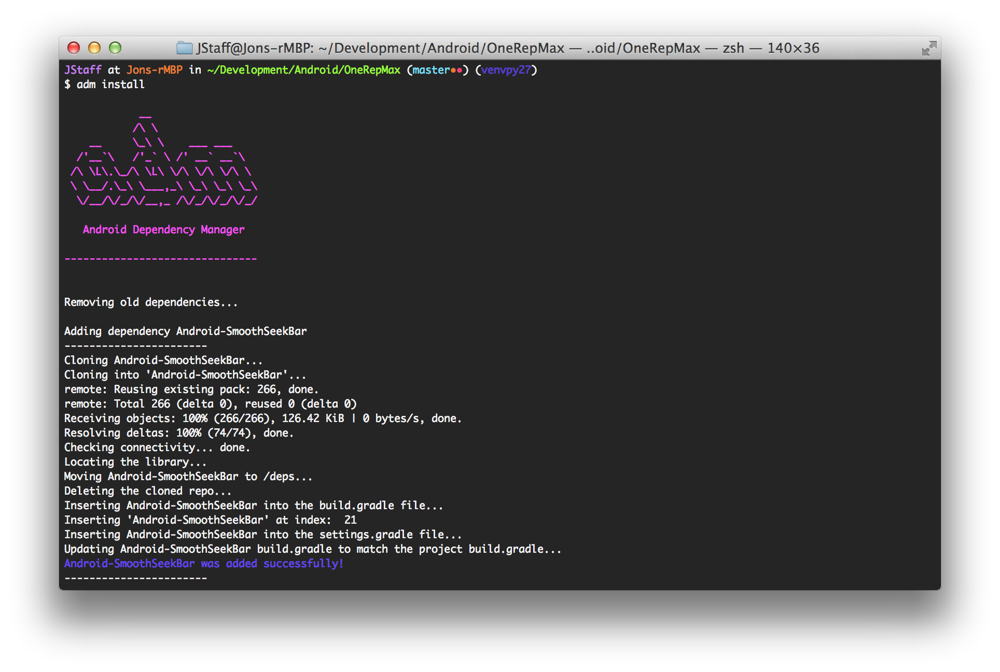

Android Dependency Manager - v1.1.0
====================================

Android Dependency Manager for libraries that aren't packaged as .jar or .aar.

If you have any feedback, don't hesitate to reach out to me on Twitter [@jonathonstaff](https://twitter.com/jonathonstaff).  I'm still actively developing this, and I understand there are some limitations - this is still in alpha.




Overview
========

adm is designed to assist Android developers who use dependencies in their projects which aren't packaged as .jar or .aar on [Maven Central](http://search.maven.org/).  This is strictly for developers using Android Studio and Gradle.  Before adding a library using adm, I highly recommend searching the Maven Central repositories (check out [Gradle, please](http://gradleplease.appspot.com/)), since this will often provide the best means of incorporating an external library.

That being said, uploading a library to Maven Central is no walk in the park, so developers frequently forgo the process altogether and simply host a public repo with their source code.  The [Facebook SDK for Android](https://github.com/facebook/facebook-android-sdk) for example, (shame on you Facebook, you're more than capable!) isn't available on Maven Central, which forces developers to clone down and manually import the library.

adm works to do this for you, quite similar to [CocoaPods](http://cocoapods.org/) for Objective-C development.  A `/deps` folder is created in the root directory of your project and all adm libraries are stored there.


Installation
============

Download the source and run:

````
$ python setup.py install
````


Usage
=====

Currently `adm install` is the only command that works.  Others will be added in time.


Create `adm_file`
-----------------

Create a json file at the root of your project titled `adm_file` with the following format:

````
{
	"dependencies": [
		{
			"name": "Android-SmoothSeekBar",
			"url": "https://github.com/Indatus/Android-SmoothSeekBar.git"
		},
		{
			"name": "Android-SwipeControl",
			"url": "https://github.com/Indatus/Android-SwipeControl.git"
		}
	]
}
````

Required attributes:

- `"name"`
- `"url"`

Future attributes:

- `"commit"`
- `"tag"`
- `"branch"`


Installing Dependencies
-----------------------

````
$ adm install
````

You should see the progess displayed in your shell window.  Once this has completed, open Android Studio and **sync** your Gradle project.


Removing Libraries
------------------

You can remove libraries by simply removing that dependency from the `adm_file` and re-running:

````
$ adm install
````


Developed By
============

[Jonathon Staff](http://jonathonstaff.com)


License
=======

    Copyright 2014 Jonathon Staff

    Licensed under the Apache License, Version 2.0 (the "License");
    you may not use this file except in compliance with the License.
    You may obtain a copy of the License at

       http://www.apache.org/licenses/LICENSE-2.0

    Unless required by applicable law or agreed to in writing, software
    distributed under the License is distributed on an "AS IS" BASIS,
    WITHOUT WARRANTIES OR CONDITIONS OF ANY KIND, either express or implied.
    See the License for the specific language governing permissions and
    limitations under the License.